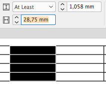
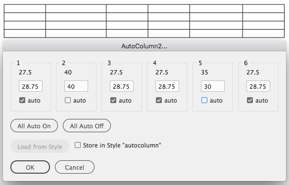

# Auto Column

## How to use

Place the cursor inside a table and start the script.

## What it does

InDesign allows you to set the width of a table one column at a time. There is no option to keep the overall width of the table the same when changing a single column.



This script opens a dialog to control all column widths in one go.



## The UI

From top to bottom:

#### 1, 2, 3, 4 ...

The number/index of the column. When you open the script for a table with many columns you will get a verrrry wide dialog.

#### 27.5, 40, 27.5 ...

The column widths before calling the script.

#### The input-fields

The new width for each column.

#### ☑︎ auto

One idea of the script is not change the overall width of the table. To achieve that you can set some columns to "auto". After adding up all non-auto-values the remainig table width is automatically distributed over the auto-values.

#### All Auto on/off

Sets or unsets all auto-checkboxes.

#### "Load from style" and "Store..."

Set the checkbox to store your widths inside the table-style assigned to the current table on clicking "OK".

That allows you to retrieve the widths in another table of the same style.

## Installation

### Basic Installation

1. Open the Scripting Panel


2. Right-click the entry "User" and select "Reveal in Finder".


3. Place script in folder "Scripts Panel"


### Startup Scripts

Some scripts are declared as "Startup Scripts". These are scripts that are automatically run, right after InDesign starts.

For those simply create a folder with the name "Startup Scripts" right beside the "Scripts Panel" folder and place the script inside.

### Storing scripts somewhere else

The "Scripts Panel" folder is located in preferences folder of your current InDesign-Version.

I have installed several versions of InDesign (since the customer and his version is "always right" ;) ) but I want to have a single installation folder that is shared among the InDesign-versions.

It used to be that an alias was good enough for this purpose but that changed a few years ago. Now you need something that is called a [symbolic link](https://apple.stackexchange.com/questions/115646/how-can-i-create-a-symbolic-link-in-terminal).

1. Find the Terminal in Application:Utilities:
1. Open the folder that contains the folder where you want to store your scripts
1. Drag the folder-symbol in the window bar onto the Terminal


By dragging the folder onto the terminal that folder is automatically set as 'current folder' so you don’t have to bother about paths.

4. Now type `ln -s nameofsourcefolder nameofsymboliclink`

In my example:

``` bash
ln -s my\ real\ scripts\ folder/ my-scripts
```


5. Drag the link (here: `my-scripts`) into your "Scripts Panel" folder

### Folder Structure

Instead of simply putting all your scripts flat into the Scripts Panel you can create a folder structure.


The Scripts panel will show the same structure:


